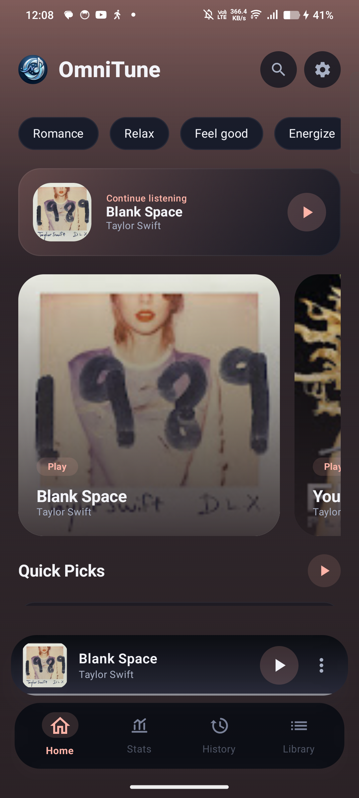
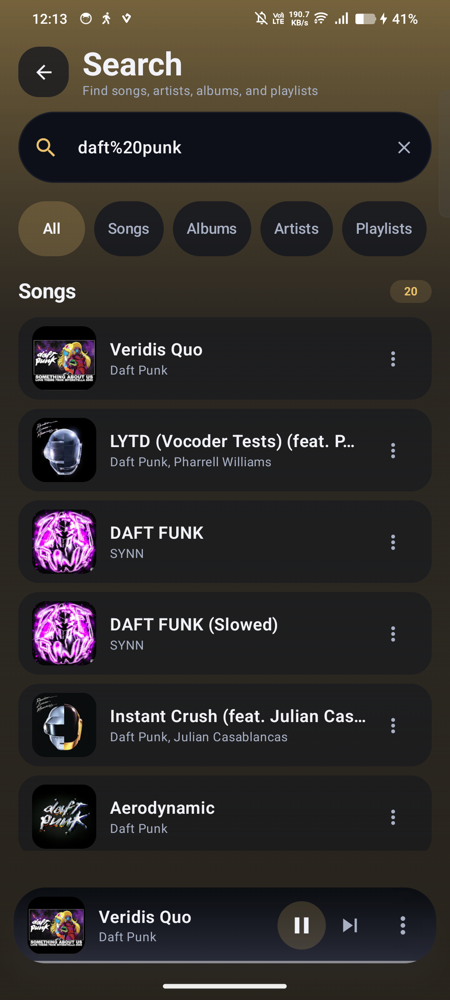
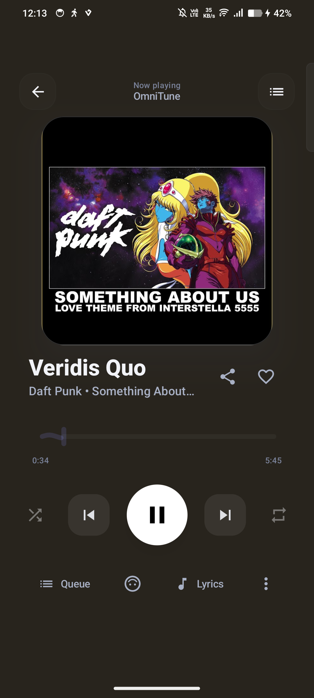

# OmniTune

<p align="center">
  
</p>

<p align="center">
  <strong>A modern open-source music player for Android.</strong>
</p>

<p align="center">
  <a href="https://github.com/soupashh-ship-it/OmniTune/releases/latest"></a>
  <a href="LICENSE"></a>
  
  
</p>

OmniTune is built for people who want a focused Android listening app with a polished Compose interface, background playback, queue control, synced lyrics, library organization, and app-managed offline downloads. It is free software under GPL-3.0 and is developed in the open.

## Screenshots

<p align="center">
  
  
  
</p>

## What OmniTune Does

**Listen**

- Search and play music through the app's YouTube InnerTube integration.
- Keep playback running in the background through Media3, MediaSession, and a foreground playback service.
- Control playback with shuffle, repeat, seek, previous/next, queue, and notification controls.

**Collect**

- Save liked songs, albums, artists, playlists, history, and playback stats in a local Room database.
- Create, rename, sort, tag, reorder, and delete playlists.
- Back up and restore library data, with optional app-managed offline audio in full archives.

**Go Offline**

- Download individual tracks, albums, and playlists through the app's Media3 download pipeline.
- Browse completed downloads from the offline library and remove or retry downloads from the app.

**Follow the Music**

- View synced lyrics when provider coverage and track metadata allow it.
- Use multiple lyrics providers, including LrcLib, KuGou, Better Lyrics, SimpMusic, and YouTube lyrics/subtitles.
- Tune lyric presentation with auto-scroll, size, spacing, and compact or large display modes.

**Shape the Experience**

- Choose playback quality modes for online streams.
- Use dynamic artwork colors, Material 3 surfaces, crossfade, sleep timer, equalizer controls, and notification settings.
- Explore home discovery sections, mood and genre browsing, Quick Picks, history, stats, album pages, artist pages, and playlist suggestions.

## Technical Foundation

| Area | Implementation |
| --- | --- |
| Language | Kotlin |
| UI | Jetpack Compose, Material 3 |
| Playback | AndroidX Media3 / ExoPlayer, MediaSession |
| Persistence | Room, DataStore |
| Dependency injection | Hilt |
| Networking | Ktor, OkHttp |
| Async state | Kotlin Coroutines and Flow |
| Images | Coil |
| Background work | WorkManager |
| Integrations | YouTube InnerTube, lyrics providers, Last.fm module, Discord Rich Presence module |

## Install

Download the latest signed APK from [GitHub Releases](https://github.com/soupashh-ship-it/OmniTune/releases/latest).

Release assets are published as `OmniTune-vX.Y.Z-release.apk` with a companion `.sha256` checksum when produced by the release workflow. Android may ask you to allow installs from your browser or file manager before installing an APK.

## Build From Source

Requirements:

- JDK 21
- Android SDK 36
- Android Studio with current Android Gradle Plugin support, or the included Gradle wrapper

Clone and build a debug APK:

```bash
git clone https://github.com/soupashh-ship-it/OmniTune.git
cd OmniTune
./gradlew assembleDebug
```

On Windows:

```powershell
git clone https://github.com/soupashh-ship-it/OmniTune.git
cd OmniTune
.\gradlew.bat assembleDebug
```

Useful verification commands:

```powershell
.\gradlew.bat testDebugUnitTest
.\gradlew.bat lintDebug
.\gradlew.bat assembleDebug
```

Firebase and Crashlytics are optional for local builds and are enabled only with `-PenableFirebase=true` and a local `app/google-services.json`. Production signing is handled by GitHub Actions through repository secrets; local release signing requires the documented `OMNITUNE_*` environment variables.

## Documentation

- [Release signing pipeline](docs/release/signed-release-pipeline.md)
- [In-app update system](docs/release/update-system.md)
- [Notification and lock-screen controls](docs/troubleshooting/notification-controls.md)
- [Music service decomposition](docs/architecture/service-decomposition.md)
- [Database DAO split](docs/architecture/database-dao-split.md)

## Contributing

Contributions are welcome when they keep playback, queue, downloads, notification behavior, attribution, and package identity intact. See [CONTRIBUTING.md](CONTRIBUTING.md) before opening a pull request.

## Privacy And Legal Notes

OmniTune is an independent open-source project. It is not affiliated with YouTube, Google, Discord, Last.fm, or the lyrics providers it can communicate with. Network features depend on third-party services and may change when those services change.

## Credits

OmniTune includes code derived from or inspired by Velune and other open-source work. Attribution is maintained in [CREDITS.md](CREDITS.md).

## License

OmniTune is licensed under the [GNU General Public License v3.0](LICENSE).
